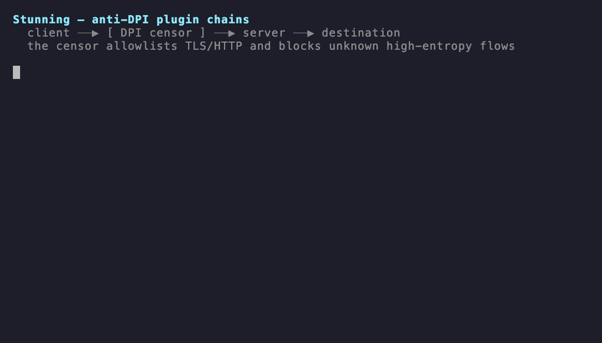

<p align="center">
  
</p>

<h1 align="center">Stunning — Network Tunneling Engine</h1>

<p align="center">
  <strong>Multi-protocol tunneling with composable anti-DPI plugin chains, access-control gates, and real-time metrics.</strong>
</p>

<p align="center">
  <a href="https://github.com/hbahadorzadeh/stunning/releases/latest"></a>
  <a href="https://github.com/hbahadorzadeh/stunning/actions"></a>
  <a href="#license"></a>
  <a href="https://golang.org"></a>
  <a href="https://github.com/sponsors/hbahadorzadeh"></a>
</p>

<p align="center">
  <a href="#what-it-does">What it does</a> •
  <a href="#install">Install</a> •
  <a href="#quick-start">Quick start</a> •
  <a href="#cli">CLI</a> •
  <a href="#library">Library</a> •
  <a href="#documentation">Docs</a>
</p>

<p align="center">
  
</p>
<p align="center">
  <sub>Same encrypted tunnel — <code>aead</code> alone gets <strong>blocked</strong>, <code>aead,tls-mimic</code> <strong>passes</strong>. <a href="test/dpi/">DPI-evasion harness →</a></sub>
</p>

---

## What it does

**Stunning** forwards network traffic through pluggable protocols and interfaces.
It's a modern, production-ready replacement for stunnel: multi-protocol, with
composable **anti-DPI plugin chains** that disguise traffic to defeat
deep-packet-inspection firewalls, **access-control gates** (authentication and
port knocking), and built-in Prometheus metrics.

It ships as a CLI, a desktop GUI, iOS/Android clients, a C shared library, and a
Go package.

**Use cases:** secure legacy services with TLS, censorship circumvention,
VPN-style tunneling, SOCKS5/HTTP proxying, protocol bridging, and microservice
gateways.

---

## Features

**Tunnel protocols (10):** `tcp`, `udp`, `udps` (secure UDP), `tls`, `http`,
`https`, `h2`, `ws` (WebSocket), `dns`, `icmp`.

**Interfaces (4):** TCP socket, SOCKS5 proxy, TUN device (VPN), serial port.

**Anti-DPI plugin chains:** per-connection, compiled-in transforms (no `.so`, no
CGO) that compress, encrypt, pad, and disguise traffic — `flate`, `aead`, `pad`,
`probe-guard`, `tls-mimic`, `http-mimic`, `jitter`, `bucket`, `profile`, `chaff`.
A high-entropy tunnel a censor would block passes cleanly once wrapped in
`tls-mimic`. → [docs/PLUGINS.md](docs/PLUGINS.md)

**Access-control gates:** authentication (`psk`, `jwt`, `mtls`, `oauth`, `ldap`)
and single-packet port knocking (`spa`). → [docs/PLUGINS.md#gates](docs/PLUGINS.md#gates)

**Management & monitoring:** process-based tunnels, Prometheus metrics, JSON +
health HTTP endpoints, auto-restart on failure.

**Distributions:** CLI, desktop (Fyne), iOS/Android, C library, Go package.

---

## Install

### From releases

Download per-platform builds from the
[latest release](https://github.com/hbahadorzadeh/stunning/releases/latest)
(verify against `SHA256SUMS.txt`):

```bash
# CLI — Linux amd64
wget https://github.com/hbahadorzadeh/stunning/releases/latest/download/stunning-cli-linux-amd64
chmod +x ./stunning-cli-linux-amd64
./stunning-cli-linux-amd64 help
```

| Distribution | Asset |
| ------------ | ----- |
| CLI | `stunning-cli-<os>-<arch>` (linux/macos/windows, amd64/arm64) |
| Desktop | `stunning-desktop-<os>-<arch>.{tar.gz,zip}` |
| C library | `libstunning-<os>-<arch>.tar.gz` (shared lib + header) |
| Mobile | `stunning-android.apk`, `libstunning.aar`, `stunning-ios-xcframework.zip` |
| Docker | `ghcr.io/hbahadorzadeh/stunning:<version>` (multi-arch CLI image) |

### Docker

A multi-arch (amd64/arm64) CLI image is published to GHCR each release:

```bash
docker pull ghcr.io/hbahadorzadeh/stunning:latest    # or :v1.1.1
docker run --rm -v "$PWD/tunnels.json:/tunnels.json" \
  ghcr.io/hbahadorzadeh/stunning -config /tunnels.json fg my-tunnel
```

### From source

```bash
git clone https://github.com/hbahadorzadeh/stunning.git
cd stunning
go build -o ./stunning .      # requires Go 1.25+
./stunning help
```

### As a Go library

```bash
go get github.com/hbahadorzadeh/stunning
```

> Building the desktop app needs X11/OpenGL headers; building mobile needs the
> Android SDK / Xcode. The Docker environment handles the desktop/CGO builds —
> see [DOCKER.md](DOCKER.md).

---

## Quick start

**1. Configure** `tunnels.json`:

```json
{
  "secure-web": {
    "ServiceMode": "server",
    "ServerType": "tls",
    "InterfaceType": "tcp",
    "Listen": "127.0.0.1:443",
    "Connect": "example.com:443",
    "Cert": "/path/to/cert.pem",
    "Key": "/path/to/key.pem"
  }
}
```

**2. Run:**

```bash
./stunning start secure-web    # background
./stunning fg    secure-web    # foreground (debugging)
./stunning status              # show all tunnels
```

A tunnel with an anti-DPI chain (same `Plugins` string on both ends):

```json
{
  "evasive": {
    "ServiceMode": "client",
    "ServerType": "tcp",
    "InterfaceType": "socks",
    "Listen": "127.0.0.1:1080",
    "Connect": "vps.example.com:8443",
    "Plugins": "flate,aead?key=0123456789abcdef0123456789abcdef,tls-mimic"
  }
}
```

See the [Configuration guide](#configuration) and
[docs/PLUGINS.md](docs/PLUGINS.md) for all fields.

---

## CLI

```bash
./stunning start  <name>     # start a tunnel in the background
./stunning fg     <name>     # run in the foreground
./stunning stop   <name>     # stop a running tunnel
./stunning status            # status of all tunnels
./stunning list              # list configured tunnels
./stunning metrics           # print Prometheus metrics
./stunning version           # version
./stunning help              # help
```

| Flag | Default | Purpose |
| ---- | ------- | ------- |
| `-config <file>` | `tunnels.json` | config file |
| `-metrics-port <port>` | `9090` | metrics HTTP port |

---

## Library

```go
package main

import "github.com/hbahadorzadeh/stunning/core"

func main() {
	cfg := core.TunnelConfig{
		ServiceMode:   "server",
		ServerType:    "tcp",
		InterfaceType: "tcp",
		Listen:        "127.0.0.1:8080",
		Connect:       "127.0.0.1:9090",
	}

	tunnel := core.TunnelFactory("my-tunnel", cfg)
	go tunnel.ListenAndServer()

	if tunnel.IsAlive() {
		m := tunnel.GetMetrics()
		println("sent:", m.BytesSent.Load(), "recv:", m.BytesReceived.Load())
		println(m.Export("my-tunnel"))      // Prometheus text
		println(m.ExportJSON("my-tunnel"))  // JSON
	}
}
```

---

## Monitoring

Metrics are exported at `http://localhost:9090`:

```bash
curl http://localhost:9090/metrics            # Prometheus text
curl http://localhost:9090/api/metrics        # JSON, all tunnels
curl http://localhost:9090/api/metrics/<name> # JSON, one tunnel
curl http://localhost:9090/health             # health check
```

Exposed series: `tunnel_uptime_seconds`, `tunnel_bytes_{sent,received}_total`,
`tunnel_connections_{total,current}`, `tunnel_errors_total` — all labeled by
`tunnel`. Point Prometheus at `localhost:9090`.

---

## Configuration

Common fields per tunnel entry:

| Field | Purpose |
| ----- | ------- |
| `ServiceMode` | `server` or `client` |
| `ServerType` | protocol — `tcp`, `udp`, `udps`, `tls`, `http`, `https`, `h2`, `ws`, `dns`, `icmp` |
| `InterfaceType` | `tcp`, `socks`, `tun`, `serial` |
| `Listen` / `Connect` | local bind / upstream target |
| `Cert` / `Key` | TLS/HTTPS certificate + key |
| `Plugins` | anti-DPI chain spec ([docs/PLUGINS.md](docs/PLUGINS.md)) |
| `Auth` / `Knock` | access-control gates ([docs/PLUGINS.md#gates](docs/PLUGINS.md#gates)) |
| `DeviceName` / `Mtu` | TUN interface options |

<details>
<summary>TUN (VPN) and SOCKS examples</summary>

```json
{
  "vpn": {
    "ServiceMode": "server", "ServerType": "tcp", "InterfaceType": "tun",
    "Listen": "10.0.0.1", "Connect": "vpn-gateway.local",
    "DeviceName": "tun0", "Mtu": "1500"
  },
  "socks-proxy": {
    "ServiceMode": "server", "ServerType": "tcp", "InterfaceType": "socks",
    "Listen": "127.0.0.1:1080", "Connect": "upstream-proxy.local:3128"
  }
}
```
</details>

---

## Platforms

| Platform | CLI | Desktop | Mobile | Library |
| -------- | :-: | :-----: | :----: | :-----: |
| Linux (x86_64, ARM64) | ✓ | ✓ | – | ✓ |
| macOS (Intel, Apple Silicon) | ✓ | ✓ | – | ✓ |
| Windows (x86_64, ARM64) | ✓ | ✓ | – | ✓ |
| iOS (ARM64) | – | – | ✓ | ✓ |
| Android (ARM64) | – | – | ✓ | ✓ |

---

## Documentation

| Doc | Contents |
| --- | -------- |
| [docs/PLUGINS.md](docs/PLUGINS.md) | Plugin chain reference, gates (auth/knock), security notes |
| [docs/BENCHMARKS.md](docs/BENCHMARKS.md) | Per-plugin and end-to-end performance |
| [test/dpi/](test/dpi/) | DPI-evasion test harness (simulated firewall) |
| [DOCKER.md](DOCKER.md) | Building with Docker (desktop/CGO/cross-platform) |
| [.github/CI_CD.md](.github/CI_CD.md) | CI and release pipelines |
| [SECURITY.md](SECURITY.md) | Security model and vulnerability reporting |
| [CONTRIBUTING.md](CONTRIBUTING.md) | How to contribute |

---

## Sponsor

**Stunning** is built and maintained in the open under the GPLv3 license — free
for everyone, including people who rely on it to reach an uncensored internet.
Sponsorship funds anti-DPI protocol research, the iOS/Android clients, security
review, and the release infrastructure.

<p align="center">
  <a href="https://github.com/sponsors/hbahadorzadeh">
    
  </a>
</p>

---

## Contributing

Contributions welcome — see [CONTRIBUTING.md](CONTRIBUTING.md).

1. Fork and create a feature branch
2. Make your changes (add tests where it makes sense)
3. Run `go test -race ./...`
4. Open a pull request

> All contributions require agreement to the
> [Contributor License Agreement (CLA)](CLA.md). Opening a pull request confirms
> your agreement; the CLA bot will ask first-time contributors to sign.

---

## License

GNU General Public License v3.0 — see [LICENSE](LICENSE).

---

## Support

- 📧 Email: h.bahadorzadeh@gmail.com
- 🐛 Issues: [GitHub Issues](https://github.com/hbahadorzadeh/stunning/issues)

<p align="center"><sub>Made with ❤️ in Go</sub></p>
